# Load a file from Cloud Storage to a Bigquery Table using a Cloud Function

- [Load a file from Cloud Storage to a Bigquery Table using a Cloud Function](#load-a-file-from-cloud-storage-to-a-bigquery-table-using-a-cloud-function)
  - [Introduction](#introduction)
  - [Tasks](#tasks)
  - [Create the Google Cloud Resources](#create-the-google-cloud-resources)
    - [1. Create a BigQuery Dataset](#1-create-a-bigquery-dataset)
    - [2. Create a BigQuery Table](#2-create-a-bigquery-table)
    - [3. Create a Google Cloud Storage Bucket](#3-create-a-google-cloud-storage-bucket)
    - [4. Create the pubsub topic for ingestion complete](#4-create-the-pubsub-topic-for-ingestion-complete)
  - [Cloud Function](#cloud-function)
    - [Update the Cloud Function Code](#update-the-cloud-function-code)
    - [Deploy the cloud function](#deploy-the-cloud-function)
  - [Ingest the data](#ingest-the-data)
  - [Documentation](#documentation)

## Introduction


In this exercise, we will create the `Ingest Data` Cloud Function, that will perform the following tasks:

1. The `Ingest Data` function will actively monitor the `[YOURNAME]-lz` Google Cloud Storage bucket for new files. This is achieved by configuring a trigger topic (*PubSub*) in the Cloud Function to listen for object creation events in the specified bucket.

2. When a new file is detected, the `Ingest Data` function will read the contents of the file and write the data into a BigQuery table named `Titanic Raw`. The function will leverage the BigQuery Python client library to facilitate this process, efficiently importing the data from the file into the specified table.

3. After successfully importing the data into BigQuery, the `Ingest Data` function will send a message to the `yourname-ingestion-complete` topic in Google Cloud Pub/Sub. This message will notify all subscribers that new data has been loaded into BigQuery, allowing them to react accordingly, such as by initiating further data processing tasks.

The Cloud Function `Ingest Data` will utilize the Google Cloud Storage, BigQuery, and Pub/Sub client libraries for these tasks. Our goal in this exercise is to fix the code for this function to make it function preperly and deploy it to Google Cloud.

The resources needed these tasks are:

- One Bigquery *Data Set* and one bigquery *Table*
  - The table schema is at: `./resources/mlops_usecase/bigquery/titanic_schema_raw.json`
- One GCS Bucket named `[your_name]-lz` where you will drop the files once the function is ready
- One Topic named `[your_name]-ingestion-complete`, to where the function will send a message once complete.

The outline of the *Cloud Function* code is available at `functions/simple_mlops/a_ingest_data/app/main.py`.

```text
.
└── a_ingest_data/
    ├── app/
    │   ├── funcs/
    │   │   ├── models.py # Models to make typechecking easier.
    │   │   ├── gcp_apis.py # Functions to call google services.
    │   │   └── transform.py # Transformations of data into structures
    │   ├── main.py # Main module and entry point for the Cloud Function
    │   └── requirements.txt # Requirements for the function execution.
    ├── config/
    │   └── dev.env.yaml # Environment variables that will ship with the function deployment
    └── tests/
        └── test_*.py # Unit tests.
```

## Tasks

- [ ] Create the Google Cloud Resources
- [ ] Update the Cloud Function Code
- [ ] Deploy the Cloud Function
- [ ] Test the Cloud Function

## Create the Google Cloud Resources

Here are the resources necessary to complete the exercise:

You can create the resources with Cloud Shell or in the Console.
***The end result will be the same. When creating a resource, choose either to create it with the cloud shell or the console, but not both.

We recommend using the UI to get a better understanding of GCP.***

For Cloud Shell, set these variables:

```bash
export PROJECT_ID=$(gcloud config get-value project)
export PROJECT_NAME=$(gcloud config get-value project)
export PROJECT_NUMBER=$(gcloud projects describe $PROJECT_ID --format='value(projectNumber)')
export REGION=europe-west3
export YOURNAME=your_name_in_lowercase
```


### 1. Create a BigQuery Dataset

<u>**Create with either Cloud Shell OR the Console UI.**</u>

With the Console:

1. Go to BigQuery:

    

2. Click the bullet points icon next to the project name:

    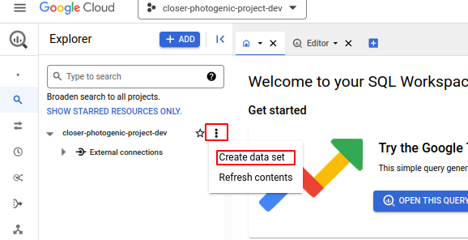

3. Name your data set, change the region, and click `CREATE DATA SET`:

    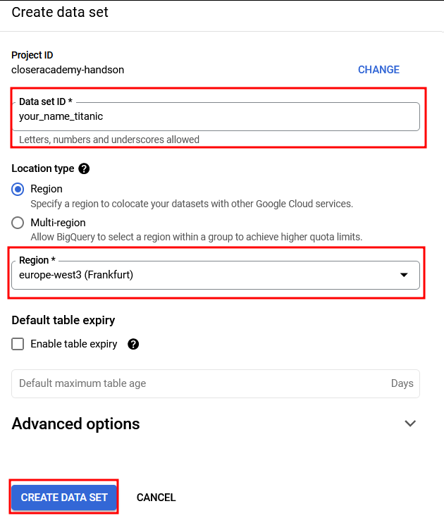

    Congratulations! You have a `data set`!

4. Edit the labels

    Click in the recently created dataset.
    

    And add the labels

    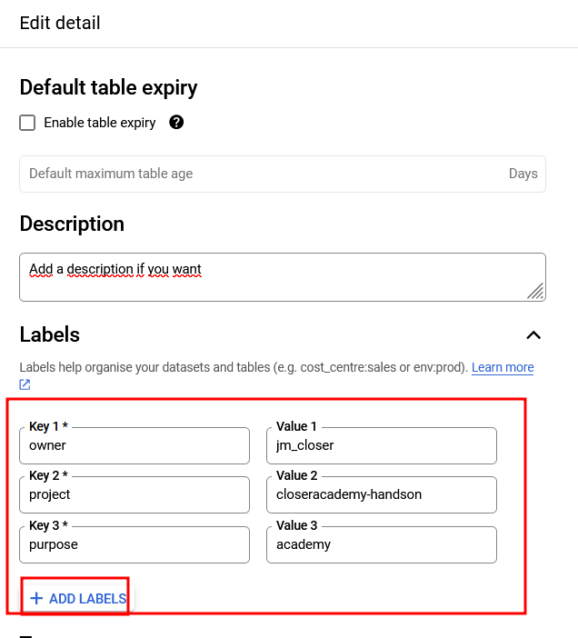

With Cloud Shell, execute the following command:

```bash
bq mk \
    --project_id ${PROJECT_ID} \
    --location ${REGION} \
    --dataset \
    --description "Dataset for the Titanic dataset" \
    --label=owner:${YOURNAME} \
    --label=project:${PROJECT_NAME} \
    --label=purpose:academy \
    ${YOURNAME}_titanic
```

Reference: [bq mk --dataset](https://cloud.google.com/bigquery/docs/reference/bq-cli-reference#mk-dataset)

### 2. Create a BigQuery Table

<u>**Create with either Cloud Shell OR the Console UI.**</u>

With the console:

1. Click the bullets icon next to your data set, and click *Create Table*:

    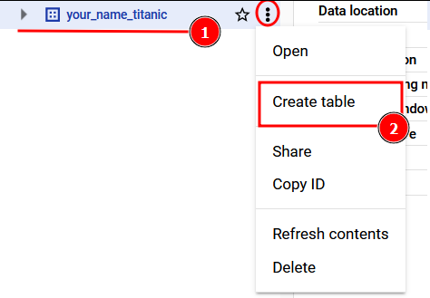

2. Configure your table:

    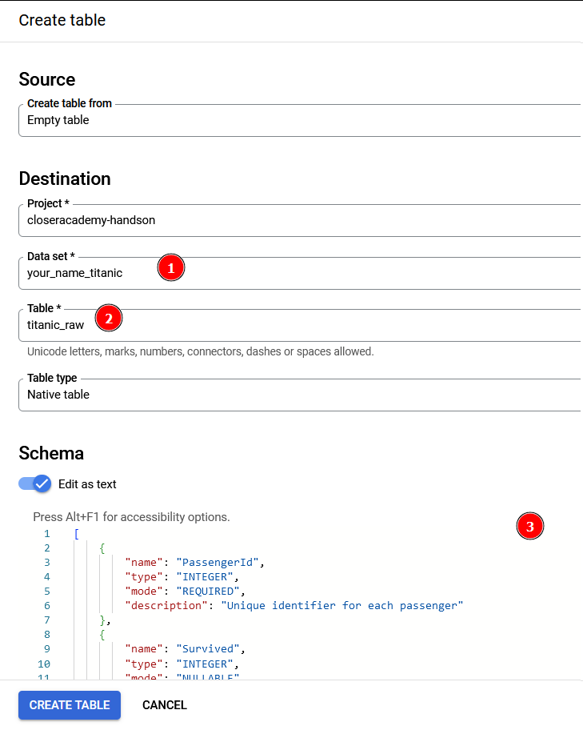

    1. Make sure it's in your dataset created in the step before
    2. Name your dataset `titanic_raw`
    3. Copy the schema in the repository folder `resources/mlops_example/bigquery/titanic_schema_raw.json` and paste it
    4. Create the table.

3. Add the labels.

    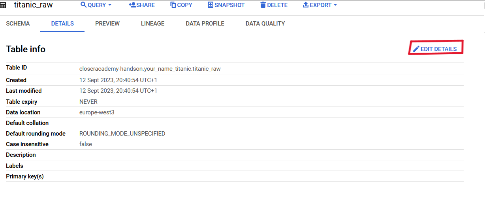

    To add the labels go to `EDIT DETAILS`, and the same way as the dataset, add the labels. Include the `Dataset` : `titanic` label.

With Cloud Shell, execute the following command:

```bash
bq mk \
    --project_id ${PROJECT_ID} \
    --table \
    --description "Table for the Titanic dataset" \
    --label=owner:${YOURNAME} \
    --label=project:${PROJECT_NAME} \
    --label=purpose:academy \
    --label=dataset:titanic \
    ${YOURNAME}_titanic.titanic_raw \
    ./resources/mlops_usecase/bigquery/titanic_schema_raw.json
```

Reference: [bq mk --table](https://cloud.google.com/bigquery/docs/reference/bq-cli-reference#mk-table)

### 3. Create a Google Cloud Storage Bucket

<u>**Create with either Cloud Shell OR the Console UI.**</u>

With the console:

1. Search for the Cloud Storage in the Search bar.

    

2. In the Cloud Storage UI, you'll notice there are no buckets created yet. To create one, click the `CREATE` button.

    

3. Configurate your bucket

    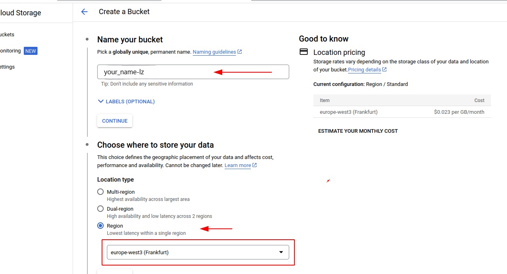

    1. Name your bucket and click Continue.
    2. Change the storage class from Multi-region to Region. Set the location to europe-west3, as shown in the image, and click Continue.
    3. Keep the remaining settings as they are.
    4. Click create.

    Your configuration should look like this:

    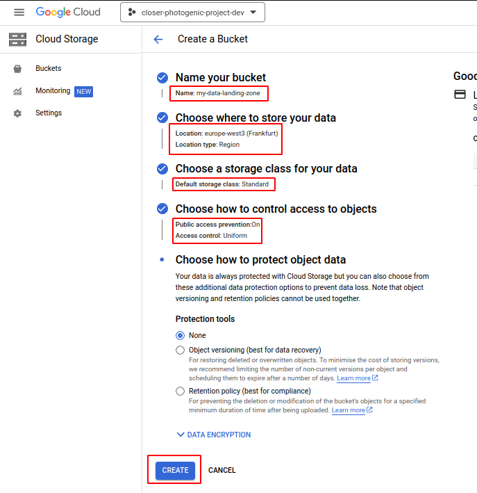

    If this popup appears, leave the settings as they are.

    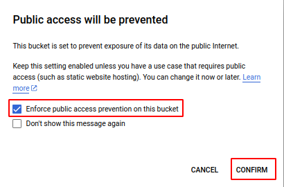

With Cloud Shell, execute the following command:

```bash
gsutil mb \
    -c regional \
    -l ${REGION} \
    -p ${PROJECT_ID} \
    gs://${YOURNAME}-lz

gsutil label ch -l owner:${YOURNAME} gs://${YOURNAME}-lz
gsutil label ch -l project:${PROJECT_NAME} gs://${YOURNAME}-lz
gsutil label ch -l purpose:academy gs://${YOURNAME}-lz
```

Reference: [gsutil mb](https://cloud.google.com/storage/docs/gsutil/commands/mb), [gsutil label](https://cloud.google.com/storage/docs/gsutil/commands/label)

And now you have your bucket!

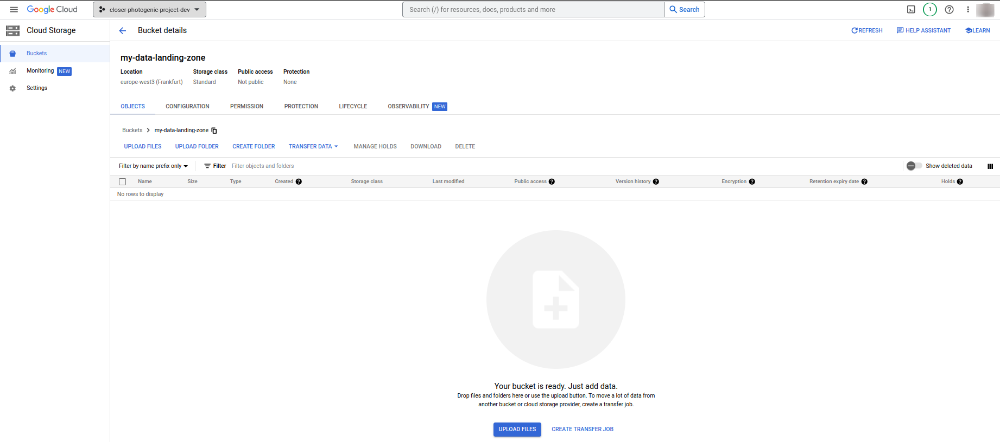

Alternatively, you can create a bucket using [Python](https://cloud.google.com/storage/docs/creating-buckets#storage-create-bucket-python), other Client Libraries, or even advanced Infrastructure-as-Code tools like [Terraform](https://cloud.google.com/storage/docs/creating-buckets#storage-create-bucket-terraform) or [Pulumi](https://www.pulumi.com/registry/packages/gcp/api-docs/storage/bucket/).

### 4. Create the pubsub topic for ingestion complete

<u>**Create with either Cloud Shell OR the Console UI.**</u>

With the Cloud Console:

1. Search for *Topics* in the search bar.
2. Click in **CREATE TOPIC**.

    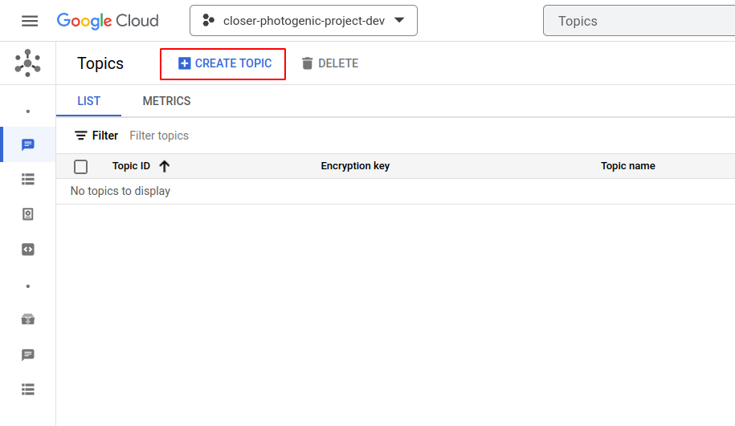

3. Define your Topic ID and click **CREATE**

    The topic ID should be `[your_name]-ingestion_complete`

    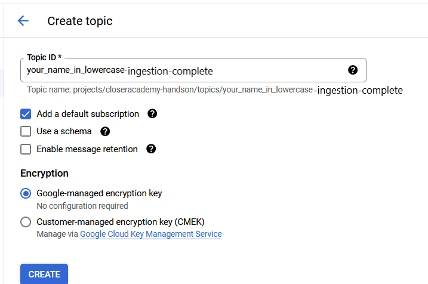

    In this case, our Topic ID is `ingestion_complete`.

    Remember where to find your Topic IDs, it will be useful when instrumenting the python scripts.

4. Verify your topic was created

   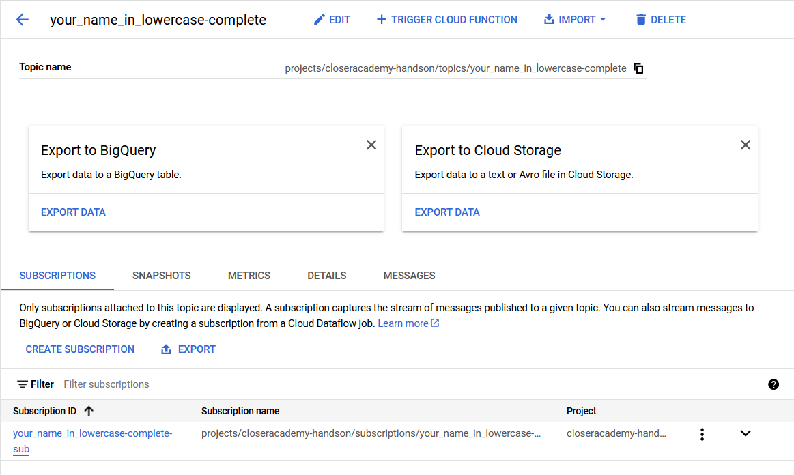

   It automatically creates a subscription, but lets ignore that for now.

With Cloud Shell:

```bash
gcloud pubsub topics create ${YOURNAME}-ingestion-complete \
    --project=${PROJECT_ID} \
    --labels=owner=${YOURNAME},project=${PROJECT_NAME},purpose=academy
```

Now we are ready to move to the cloud function code.

## Cloud Function

### Update the Cloud Function Code

Here are the steps necessary to complete the exercise:

1. Set Environment Variables

    In the `functions/mlops_usecase/a_ingest_data/config/dev.env.yaml` file, change the environment variables for the correct ones.

    ```yaml
    _GCP_PROJECT_ID: "The GCP project ID where the resources are located"
    _BIGQUERY_DATASET_ID: "The BigQuery dataset ID you created"
    _BIGQUERY_TABLE_ID: "The BigQuery table ID where you will store the data"
    _TOPIC_INGESTION_COMPLETE: "The Pub/Sub topic ID where you will send a message once the data is ingested"
    ```

2. Publish the message: To verify you concluded this step with success, change the string in the `'closer-origin-function'` to `'functions.mlops.ingest_data'`

    ```python
    ########################################
    # 2. Send the verification attribute ###
    ########################################

    _ = gcp_apis.pubsub_publish_message(
        PS=gcp_clients.publisher,
        project_id=env_vars.gcp_project_id,
        topic_id='verification',
        message='ok',
        attributes={
        'closer-origin-function': 'functions.mlops.ingest_data',
        'closer-origin-topic': env_vars.topic_ingestion_complete,
        },
    )
    ```

### Deploy the cloud function

You can check the deployment here in [Cloud Build](https://console.cloud.google.com/cloud-build/builds;region=europe-west3?referrer=search&project=closeracademy-handson)

```bash
# Remeber to have $YOURNAME from the first export to the Cloud Shell. 
# Uncomment the next lines if you see necessary
# export REGION=europe-west3
# export YOURNAME=your_name_in_lowercase
export FUNCTION_NAME="ingest_data"
export PATH_TO_FUNCTION="functions/mlops_usecase/a_ingest_data"

gcloud beta functions deploy ${YOURNAME}-${FUNCTION_NAME} \
    --gen2 --cpu=1 --memory=512MB \
    --region=${REGION} \
    --runtime=python311 \
    --source=${PATH_TO_FUNCTION}/app/ \
    --env-vars-file=${PATH_TO_FUNCTION}/config/dev.env.yaml \
    --entry-point=main \
    --trigger-event-filters="type=google.cloud.storage.object.v1.finalized" \
    --trigger-event-filters="bucket=${YOURNAME}-lz"
```

Reference: [gcloud functions deploy](https://cloud.google.com/sdk/gcloud/reference/functions/deploy)

This code deploys a Google Cloud Function named "ingest_data" using the gcloud command-line tool. The function is written in Python 3.11 and is triggered by a Google Cloud Storage object finalization event in the "${YOURNAME}-lz" bucket.

The function is deployed with the following configuration:

- CPU: 1
- Memory: 512MB
- Region: $REGION
- Runtime: python311
- Source code location: "${PATH_TO_USECASE}/app/"
- Environment variables: loaded from "${PATH_TO_USECASE}/config/dev.env.yaml"
- Entry point: "main"
- Trigger: Google Cloud Storage object finalization event in the "${YOURNAME}-lz" bucket

## Ingest the data

Go to the Cloud Functions UI in the console, you can confirm the cloud function was deployed successfully. (By searching in the search box), you can check if the deployment was correctly made.


## Documentation

::: mlops_usecase.a_ingest_data.app.main

::: mlops_usecase.a_ingest_data.app.funcs.gcp_apis

::: mlops_usecase.a_ingest_data.app.funcs.transform

::: mlops_usecase.a_ingest_data.app.funcs.models
