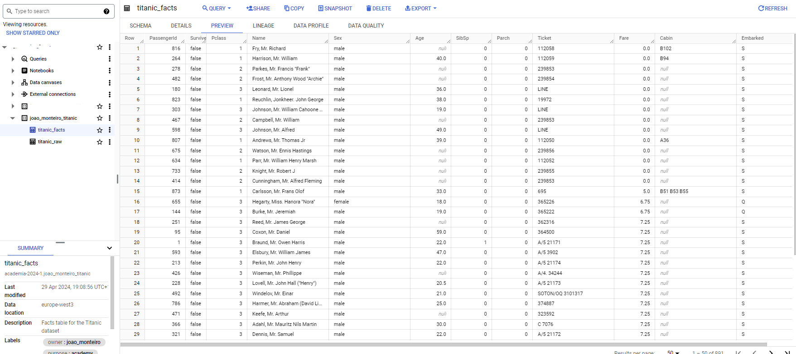

# Query Staging to Facts

- [Query Staging to Facts](#query-staging-to-facts)
  - [Introduction](#introduction)
  - [Tasks](#tasks)
  - [Create the Google Cloud Resources](#create-the-google-cloud-resources)
    - [1. Create a BigQuery Table](#1-create-a-bigquery-table)
    - [2. Create the pubsub topic for update facts complete](#2-create-the-pubsub-topic-for-update-facts-complete)
  - [Update the Cloud Function Code](#update-the-cloud-function-code)
  - [Deploy the cloud function](#deploy-the-cloud-function)
  - [Verify the data was moved from raw to facts](#verify-the-data-was-moved-from-raw-to-facts)
  - [Documentation](#documentation)

## Introduction


In this exercise, we will create the `Query To Facts` Cloud Function, that will perform the following tasks:

1. Will be triggered by the topic `[yourname]-ingestion-complete`.

2. It will request a query to be executed by BigQuery. This query is partially done, and is part of the exercise to complete it.

3. After successfully executing the query, this function will send a message to the topic `[yourname]-update-facts-complete`.

The Cloud Function `Update Facts` will utilize the BigQuery, and Pub/Sub client libraries for these tasks.

The resources needed these tasks are:

- The already created *Dataset* and *Raw Table* in step 1.
- One Bigquery table, `Titanic Facts`
  - The table schema is at: `./resources/mlops_usecase/bigquery/facts_titanic_schema.json`
- Two Pub/Sub topics, the one already created, and one named `[yourname]-update-facts-complete`, to where the function will send a message once complete.

The outline of the *Cloud Function* code is available at `functions/mlops_usecase/b_update_facts/app`.

```text
.
└── b_update_facts/
    ├── app/
    │   ├── funcs/
    │   │   ├── models.py # Models to make typechecking easier.
    │   │   ├── gcp_apis.py # Functions to call google services.
    │   │   └── common.py # Common functions (Utils).
    │   ├── main.py # Main module and entry point for the Cloud Function
    │   └── requirements.txt # Requirements for the function execution.
    ├── config/
    │   └── dev.env.yaml # Environment variables that will ship with the function deployment
    └── tests/
        └── test_*.py # Unit tests.
```

## Tasks

- [ ] Create the Google Cloud Resources
- [ ] Update the Cloud Function Code
- [ ] Test the Cloud Function
- [ ] Deploy the Cloud Function

## Create the Google Cloud Resources

Here are the resources necessary to complete the exercise:

You can create the resources with Cloud Shell or in the Console.
***The end result will be the same. When creating a resource, choose either to create it with the cloud shell or the console, but not both.***

For Cloud Shell, set these variables:

```bash
export PROJECT_ID=$(gcloud config get-value project)
export PROJECT_NAME=$(gcloud config get-value project)
export PROJECT_NUMBER=$(gcloud projects describe $PROJECT_ID --format='value(projectNumber)')
export REGION=europe-west3
export YOURNAME=your_name_in_lowercase
```


### 1. Create a BigQuery Table

<u>**Create with either Cloud Shell OR the Console UI.**</u>

With the console:

[Same as step 1](./step1.md#2-create-a-bigquery-table), but now create a table with the name `titanic_facts` and use the schema `facts_titanic_schema.json`

With Cloud Shell, execute the following command:

```bash
bq mk \
    --project_id ${PROJECT_ID} \
    --table \
    --description "Facts table for the Titanic dataset" \
    --label=owner:${YOURNAME} \
    --label=project:${PROJECT_NAME} \
    --label=purpose:academy \
    --label=dataset:titanic \
    ${YOURNAME}_titanic.titanic_facts \
    ./resources/mlops_usecase/bigquery/facts_titanic_schema.json
```

Reference: [bq mk --table](https://cloud.google.com/bigquery/docs/reference/bq-cli-reference#mk-table)

### 2. Create the pubsub topic for update facts complete


With the Cloud Console:

[Same as in step 1](./step1.md#4-create-the-pubsub-topic-for-ingestion-complete), but now with the name `[yourname]-update-facts-complete`

Now we are ready to move to the cloud function code.

With Cloud Shell:

```bash
gcloud pubsub topics create ${YOURNAME}-update-facts-complete \
    --project=${PROJECT_ID} \
    --labels=owner=${YOURNAME},project=${PROJECT_NAME},purpose=academy
```

## Update the Cloud Function Code

Here are the steps necessary to complete the exercise:

1. Set Environment Variables

    In the `b_update_facts/config/dev.env.yaml` file, change the environment variables for the correct ones.

    ```python
    ##############################
    # 1. Environment variables ###
    ##############################
    ```

    ```yaml
    _GCP_PROJECT_ID: "The GCP project ID where the resources are located"
    _BIGQUERY_DATASET_ID: "The BigQuery dataset ID you created"
    _BIGQUERY_FACTS_TABLE_ID: "The BigQuery staging table ID"
    _BIGQUERY_STAGING_TABLE_ID: "The BigQuery facts table ID where the data will be moved towards"
    _TOPIC_UPDATE_FACTS_COMPLETE: "The Pub/Sub topic ID where you will send a message once the data is ingested"
    ```

2. Update the SQL Code

    Go to the file `b_update_facts/app/resources/staging_to_facts.sql`, and update the SQL Query to select the correct fields.

    ```sql
    MERGE `{table_target}` AS T
    USING (
        SELECT
            ???
            IF(Survived = 1, True, False) AS Survived,
            ????
        FROM
            `{table_source}`
        WHERE run_hash = "{run_hash}"
        QUALIFY ROW_NUMBER() OVER (PARTITION BY PassengerId ORDER BY Survived DESC) = 1
    ) S
    ON (
        S.PassengerId = T.PassengerId
    )
    WHEN NOT MATCHED BY TARGET THEN
    INSERT (
        ???,
        ???,
        ...
    )
    VALUES (
        ???,
        ???,
        ...
    )
    ```

## Deploy the cloud function

You can check the deployment here in [Cloud Build](https://console.cloud.google.com/cloud-build/builds;region=europe-west3?referrer=search&project=closeracademy-handson)

Reference: [gcloud functions deploy](https://cloud.google.com/sdk/gcloud/reference/functions/deploy)

```bash
# Remeber to have $YOURNAME from the first export to the Cloud Shell. 
# Uncomment the next lines if you see necessary
# export REGION=europe-west3
# export YOURNAME=your_name_in_lowercase
export FUNCTION_NAME="update_facts"
export PATH_TO_FUNCTION="functions/mlops_usecase/b_update_facts"

gcloud beta functions deploy $YOURNAME-$FUNCTION_NAME \
    --gen2 --cpu=1 --memory=512MB \
    --region=europe-west3 \
    --runtime=python311 \
    --source=${PATH_TO_FUNCTION}/app/ \
    --env-vars-file=${PATH_TO_FUNCTION}/config/dev.env.yaml \
    --entry-point=main \
    --trigger-topic=${YOURNAME}-ingestion-complete
```

## Verify the data was moved from raw to facts

!!! warning
    Since the function is triggered by the `ingestion-complete` topic, you'll need to re-activate the previous ingestion function. You can achieve this by re-adding the `titanic.csv` file to the bucket. In the UI, you can upload and `Overwrite File`.

    In the command line, you can do this with the following command:

    `gsutil cp resources/mlops_usecase/data/titanic.csv gs://${YOURNAME}-lz/`

To confirm that you sucessfully completed this phase, you can check the data in the BigQuery table.



And, the same way as in Step 1, you can also verify the logs of the Cloud Function `Update Facts`.

## Documentation

::: mlops_usecase.b_update_facts.app.main

::: mlops_usecase.b_update_facts.app.funcs.gcp_apis

::: mlops_usecase.b_update_facts.app.funcs.common

::: mlops_usecase.b_update_facts.app.funcs.models
