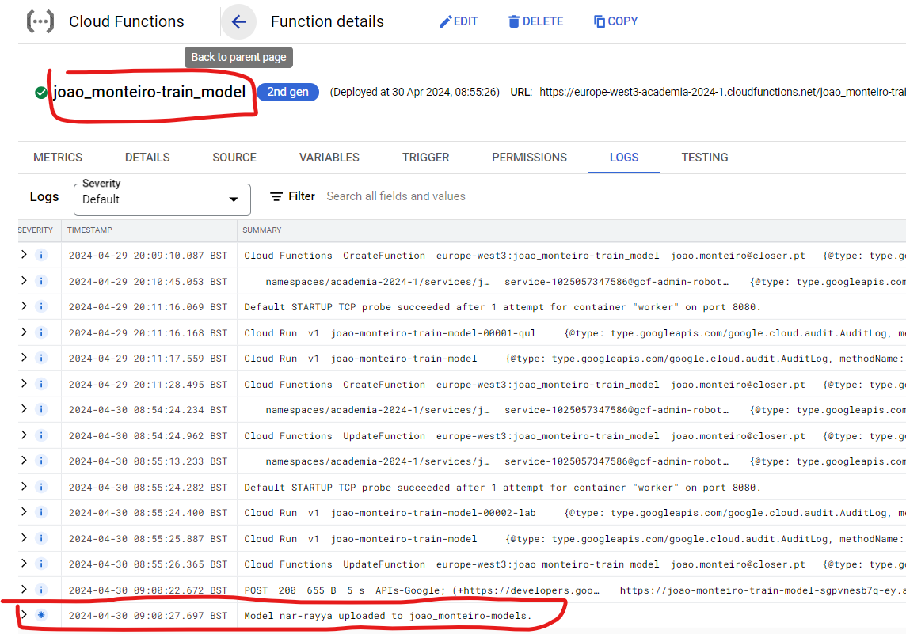

# Deploy a Cloud function that trains a model and saves it in GCS

- [Deploy a Cloud function that trains a model and saves it in GCS](#deploy-a-cloud-function-that-trains-a-model-and-saves-it-in-gcs)
  - [Introduction](#introduction)
  - [Tasks](#tasks)
  - [Create the Google Cloud Resources](#create-the-google-cloud-resources)
    - [1. Create the models GCS Bucket](#1-create-the-models-gcs-bucket)
    - [2. Create the pubsub topic for train model complete](#2-create-the-pubsub-topic-for-train-model-complete)
  - [Update the Cloud Function Code](#update-the-cloud-function-code)
  - [Deploy the cloud function](#deploy-the-cloud-function)
  - [Confirm the model was uplodad](#confirm-the-model-was-uplodad)
  - [Documentation](#documentation)

## Introduction


In this exercise, we will create a Cloud Function called `Train Model`, which will be responsible for training a machine learning model using the data ingested in the previous steps. The function will be triggered by the `update-facts-complete` Pub/Sub topic, ensuring it starts training once new facts data is available in the BigQuery table. The steps involved in this process are as follows:

1. The `Train Model` Cloud Function is subscribed to the `[yourname]-update-facts-complete` topic, and it will be triggered automatically when a new message is published, indicating that new data has been loaded into the BigQuery table.

2. Upon being triggered, the `train_model` function retrieves the data from the `Titanic Facts` BigQuery table using the appropriate query. This data will be used to train a machine learning model, such as an Scikit-learn Random Forest or Logistic Regression model.

3. After the model is trained using the fetched data, the `Train Model` function saves the trained model to the `[yourname]-models` Google Cloud Storage bucket. You can choose the name for this model, but it should be unique.

This exercise will guide you through the process of developing the `train_model` Cloud Function, which leverages the power of BigQuery, Scikit-learn, and Google Cloud Storage to create, train, and store a machine learning model.

For this you will need these resources:

- The already created *Data Set* in step 1.
- The already created *Bigquery Table* in step 2.
- A Pub/Sub topic named `[yourname]-train-model-complete` where you will publish a success message.
- One GCS Bucket named `[yourname]-models` where you will save the model

The outline of the *Cloud Function* code is available at `./functions/simple_mlops/c_train_model/app`

```text
c_train_model/
├── app/
│   ├── funcs/
│   │   ├── models.py # Models to make typechecking easier.
│   │   ├── gcp_apis.py # Functions to call google services.
│   │   ├── common.py # Common functions (Utils).
|   |   └── train_model.py # Train model functions
│   ├── main.py # Main module and entry point for the Cloud Function
│   └── requirements.txt # Requirements for the function execution.
├── config/
│   └── dev.env.yaml # Environment variables that will ship with the function deployment
└── tests/
    └── test_*.py # Unit tests.
```

## Tasks

- [ ] Create the Google Cloud Resources
- [ ] Update the Cloud Function Code
- [ ] Test the Cloud Function
- [ ] Deploy the Cloud Function

## Create the Google Cloud Resources

Here are the resources necessary to complete the exercise:

You can create the resources with Cloud Shell or in the Console.
***The end result will be the same. When creating a resource, choose either to create it with the cloud shell or the console, but not both.***

For Cloud Shell, set these variables:

```bash
export PROJECT_ID=$(gcloud config get-value project)
export PROJECT_NAME=$(gcloud config get-value project)
export REGION=europe-west3
export YOURNAME=your_name_in_lowercase
```


### 1. Create the models GCS Bucket

<u>**Create with either Cloud Shell OR the Console UI.**</u>

With the console:

[Same as in step 1](./step1.md#3-create-a-google-cloud-storage-bucket), but now the bucket name is `[yourname]-models`

```bash
gsutil mb \
    -c regional \
    -l ${REGION} \
    -p ${PROJECT_NAME} \
    gs://${YOURNAME}-models

gsutil label ch -l owner:${YOURNAME} gs://${YOURNAME}-models
gsutil label ch -l project:${PROJECT_NAME} gs://${YOURNAME}-models
gsutil label ch -l purpose:academy gs://${YOURNAME}-models
```

Reference: [gsutil mb](https://cloud.google.com/storage/docs/gsutil/commands/mb), [gsutil label](https://cloud.google.com/storage/docs/gsutil/commands/label)

### 2. Create the pubsub topic for train model complete

With the Cloud Console:

[Same as in step 1](./step1.md#4-create-the-pubsub-topic-for-ingestion-complete), but now with the name `[yourname]-train-model-complete`

Now we are ready to move to the cloud function code.

With Cloud Shell:

```bash
gcloud pubsub topics create ${YOURNAME}-train-model-complete \
    --project=${PROJECT_ID} \
    --labels=owner=${YOURNAME},project=${PROJECT_NAME},purpose=academy
```

## Update the Cloud Function Code

1. Set Environment Variables

    In the `c_train_model/config/dev.env.yaml` file, change the environment variables for the correct ones.

    ```python
    ##############################
    # 1. Environment variables ###
    ##############################
    ```

    ```yaml
    _GCP_PROJECT_ID: "The GCP project ID where the resources are located"
    _GCS_BUCKET_NAME_MODELS: "The GCS bucket name where the models will be saved"
    _TOPIC_TRAINING_COMPLETE: "The Pub/Sub topic name where the success message will be published"
    ```

## Deploy the cloud function

You can check the deployment here in [Cloud Build](https://console.cloud.google.com/cloud-build/builds;region=europe-west3?referrer=search&project=closeracademy-handson)

Reference: [gcloud functions deploy](https://cloud.google.com/sdk/gcloud/reference/functions/deploy)

```bash
# Remeber to have $YOURNAME from the first export to the Cloud Shell. 
# Uncomment the next lines if you see necessary
# export REGION=europe-west3
# export YOURNAME=your_name_in_lowercase
export FUNCTION_NAME="train_model"
export PATH_TO_FUNCTION="functions/mlops_usecase/c_train_model"

gcloud beta functions deploy $YOURNAME-$FUNCTION_NAME \
    --gen2 --cpu=1 --memory=512MB \
    --region=europe-west3 \
    --runtime=python311 \
    --source=${PATH_TO_FUNCTION}/app/ \
    --env-vars-file=${PATH_TO_FUNCTION}/config/dev.env.yaml \
    --entry-point=main \
    --trigger-topic=$YOURNAME-update-facts-complete
```

## Confirm the model was uplodad

!!! warning
    Since the function is triggered by the `update-facts-complete`, which is activated by CF `Update Facts`, which is activated by the `ingestion-complete` topic,
    you'll need to re-activate the previous ingestion function. You can achieve this by re-adding the `titanic.csv`.
    file to the bucket. In the UI, you can upload and `Overwrite File`.

    In the command line, you can do this with the following command:

    `gsutil cp resources/mlops_usecase/data/titanic.csv gs://${YOURNAME}-lz/`

To verify that the model was correctly uploaded, you can 1) Check the cloud function logs, and 2) Go to your cloud storage bucket `your_name_in_lowercase-models`.

1.
    

2.
    

## Documentation

::: mlops_usecase.c_train_model.app.main

::: mlops_usecase.c_train_model.app.funcs.train_models

::: mlops_usecase.c_train_model.app.funcs.common

::: mlops_usecase.c_train_model.app.funcs.gcp_apis

::: mlops_usecase.c_train_model.app.funcs.models
