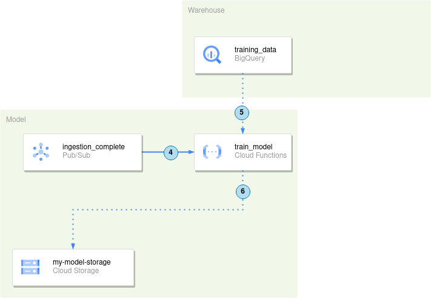

# Deploy a Cloud function that trains a model and saves it in GCS

- [Deploy a Cloud function that trains a model and saves it in GCS](#deploy-a-cloud-function-that-trains-a-model-and-saves-it-in-gcs)
  - [Documentation](#documentation)



In this exercise, we will create a Cloud Function called `train_model`, which will be responsible for training a machine learning model using the data ingested in the previous steps. The function will be triggered by the `ingestion_complete` Pub/Sub topic, ensuring it starts training once new data is available in the BigQuery table. The steps involved in this process are as follows:

4. The `train_model` Cloud Function is subscribed to the `ingestion_complete` topic, and it will be triggered automatically when a new message is published, indicating that new data has been loaded into the BigQuery table.

5. Upon being triggered, the `train_model` function retrieves the data from the `training_data` BigQuery table using the appropriate query. This data will be used to train a machine learning model, such as a Scikit-learn Random Forest or Logistic Regression model.

6. After the model is trained using the fetched data, the `train_model` function saves the trained model to the `my-model-storage` Google Cloud Storage bucket. The user implementing this function can choose the preferred naming convention for the saved model.

This exercise will guide you through the process of developing the `train_model` Cloud Function, which leverages the power of BigQuery, Scikit-learn, and Google Cloud Storage to create, train, and store a machine learning model.

For this you will need these resources:

- One Bigquery `data set` and two bigquery `tables` (The schemas are available at `./infrastructure/bigquery/titanic_schema_raw.json`)
- One GCS Bucket named `[prefix]-models-bucket` where you will save the model
- One GCS Bucket named `[prefix]-functions-bucket` where you will deploy the function source code from.
- One Topic named `[prefix]-ingestion-complete`, to which the function will be subscribed to.

The outline of the *Cloud Function* code is available at `./functions/manual_exercises/c_train_model/`

1. Decode Base64 Message: Add code to decode the base64 message.

```python
# IMPLEMENTATION [1]: Add code to decode the base64 message.
```

2. Create Clients: Use the Google Cloud Storage API and BigQuery API to create respective client objects.

```python
# IMPLEMENTATION [1]: Use the storage API to make a Client Object
# IMPLEMENTATION [2]: Use the bigquery API to make a Client Object
```

3. Create SQL Query: Create an SQL query to retrieve data from the BigQuery table with Titanic data.

```python
# IMPLEMENTATION [3]: Create an SQL query to retrieve data from the bigquery table with Titanic data.
```

4. Set Bucket Name: Add your GCS bucket name to store the trained model.

```python
# IMPLEMENTATION [4]: Add your prefix-bucket-models here.
```

5. Set Model Name: Give a name to your trained model.

```python
# IMPLEMENTATION [5]: Give a name to your model.
```

6. Connect to Bucket: Connect to the GCS bucket using the correct method for the Storage Client.

```python
# IMPLEMENTATION [6]: Connect to the bucket in [4] using the correct method
```

7. Connect to Blob: Connect to the blob (file object) inside the bucket, using the bucket object.

```python
# IMPLEMENTATION [7]: Connect to the blob(file object) inside the bucket, using the `bucket` object.
```

8. (Optional) Remove Columns: Remove any additional columns that shouldn't be passed to the model.

```python
# OPTIONAL [1]: Add 'set_type' or other columns that shouldn't be passed to the model.
```

Remember to remove the pass statement after implementing the first step (Decoding Base64 Message).

Deployment:

```bash
gcloud beta functions deploy jm_test_train_model \
    --gen2 --cpu=1 --memory=512MB \
    --region=europe-west3 \
    --runtime=python311 \
    --source=functions/simple_mlops/c_train_model/app/ \
    --env-vars-file=functions/simple_mlops/c_train_model/config/dev.env.yaml \
    --entry-point=main \
    --trigger-topic=your_name_in_lowercase-update-facts-complete
```

## Documentation

Remember, you can still find it in the correct folder.

::: simple_mlops.c_train_model.app.main
